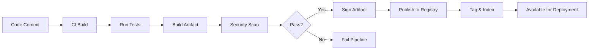

# Artifact Management Strategy
## DevOps Multi-Cloud Project

**Author:** DevOps Engineering Team  
**Date:** December 2025  
**Document Type:** Strategy Document

---

## Executive Summary

This document outlines the artifact management strategy for our DevOps multi-cloud project. It defines policies, procedures, and best practices for storing, versioning, and distributing build artifacts across our CI/CD pipeline and deployment environments.

**Key Components:**
- Docker image registry management
- Binary artifact storage and versioning
- Dependency management
- Artifact lifecycle and retention policies
- Security and access control

---

## 1. Introduction

### 1.1 What are Artifacts?

In the context of CI/CD, artifacts are immutable files produced during the build process, including:

- **Container Images**: Docker/OCI images
- **Application Binaries**: Compiled executables, JARs, packages
- **Dependencies**: Libraries, packages, modules
- **Configuration Files**: Helm charts, Kubernetes manifests
- **Documentation**: API docs, release notes
- **Test Reports**: Coverage reports, security scan results

### 1.2 Importance of Artifact Management

Proper artifact management ensures:
- **Reproducibility**: Ability to rebuild and redeploy exact versions
- **Traceability**: Track artifacts back to source code commits
- **Security**: Scan and verify artifact integrity
- **Efficiency**: Reduce build times through caching
- **Compliance**: Meet regulatory requirements for change management

---

## 2. Artifact Types and Storage

### 2.1 Container Images

**Storage Solutions:**

| Environment | Registry | Purpose |
|-------------|----------|---------|
| Development | GitHub Container Registry (GHCR) | Public/team access, integrated with GitHub Actions |
| Production | AWS ECR / Azure ACR / GCP Artifact Registry | Cloud-native, private, multi-region |
| Local/Testing | Docker Hub | Public images, community sharing |

**Naming Convention:**
```
<registry>/<organization>/<application>:<tag>

Examples:
- ghcr.io/myorg/devops-sample-app:1.2.3
- ghcr.io/myorg/devops-sample-app:main-a1b2c3d
- ghcr.io/myorg/devops-sample-app:pr-123
- ghcr.io/myorg/devops-sample-app:latest
```

**Tagging Strategy:**

| Tag Type | Format | Purpose | Example |
|----------|--------|---------|---------|
| Semantic Version | `v{MAJOR}.{MINOR}.{PATCH}` | Production releases | `v1.2.3` |
| Git SHA | `{branch}-{short-sha}` | Development builds | `main-a1b2c3d` |
| PR Number | `pr-{number}` | Pull request builds | `pr-123` |
| Branch | `{branch}` | Latest on branch | `develop` |
| Latest | `latest` | Current production | `latest` |

> [!WARNING]
> Never use `latest` tag in production manifests. Always pin to specific versions.

### 2.2 Application Binaries

**Storage**: AWS S3 / Azure Blob Storage / GCP Cloud Storage

**Structure:**
```
<bucket-name>/
├── releases/
│   ├── v1.0.0/
│   │   ├── app-linux-amd64
│   │   ├── app-darwin-amd64
│   │   └── checksums.txt
│   └── v1.1.0/
│       └── ...
├── snapshots/
│   └── main-20231216/
│       └── ...
└── dependencies/
    └── ...
```

### 2.3 Helm Charts and Kubernetes Manifests

**Storage**: Dedicated Helm repository (ChartMuseum, Harbor, or cloud-hosted)

**Structure:**
```
charts/
├── devops-sample-app/
│   ├── Chart.yaml
│   ├── values.yaml
│   ├── values-dev.yaml
│   ├── values-prod.yaml
│   └── templates/
│       ├── deployment.yaml
│       ├── service.yaml
│       └── ingress.yaml
```

**Versioning**: Follows semantic versioning, independent of application version

---

## 3. Artifact Lifecycle Management

### 3.1 Creation and Publishing



**Process:**
1. **Build**: Create artifact deterministically from source code
2. **Test**: Validate artifact functionality
3. **Scan**: Security vulnerability scanning (Trivy, Snyk)
4. **Sign**: Digital signature for integrity verification
5. **Publish**: Upload to appropriate registry
6. **Index**: Update metadata and search indexes

### 3.2 Retention Policy

| Artifact Type | Retention Period | Cleanup Strategy |
|---------------|------------------|------------------|
| Production releases | Indefinite | Manual archival only |
| Pre-release/RC | 90 days | Automated cleanup |
| Development builds | 30 days | Automated cleanup |
| PR builds | 7 days | Automated cleanup on PR close |
| Failed builds | 1 day | Immediate cleanup |

**Implementation:**
```yaml
# Example: GitHub Container Registry cleanup action
name: Cleanup old images
on:
  schedule:
    - cron: '0 0 * * 0'  # Weekly

jobs:
  cleanup:
    runs-on: ubuntu-latest
    steps:
      - name: Delete untagged images
        run: |
          # Delete images older than 30 days without tags
          ghcr-cleanup --older-than 30d --untagged
      
      - name: Delete PR images
        run: |
          # Delete PR images older than 7 days
          ghcr-cleanup --older-than 7d --tag-pattern 'pr-*'
```

### 3.3 Promotion Strategy

Artifacts progress through environments via promotion, not rebuilding:

```
┌──────────────────────────────────────────────────────┐
│             Artifact Promotion Flow                   │
└──────────────────────────────────────────────────────┘

Development (main-a1b2c3d)
    ↓ Test & Validate
Staging (v1.2.3-rc.1)
    ↓ QA Approval
Pre-Production (v1.2.3-rc.1)
    ↓ Final Validation
Production (v1.2.3)
    ↓ Release Tag
Archive (v1.2.3 → long-term storage)
```

**Key Principle**: Same artifact binary promotes across environments, only configuration changes

---

## 4. Security and Access Control

### 4.1 Registry Security

**Authentication Methods:**

| Registry | Authentication | Token Scope |
|----------|---------------|------------|
| GHCR | GitHub Personal Access Token | Repo-specific |
| Docker Hub | Username/Password or Token | Account-wide |
| AWS ECR | IAM credentials | Resource-based |
| Azure ACR | Service Principal | Role-based |
| GCP Artifact Registry | Service Account | IAM-based |

**Best Practices:**
- ✅ Use service accounts for CI/CD automation
- ✅ Rotate tokens every 90 days
- ✅ Implement least-privilege access
- ✅ Enable audit logging
- ✅ Use private registries for proprietary code

### 4.2 Image Signing and Verification

**Tool**: Cosign (Sigstore project)

**Signing Process:**
```bash
# Generate key pair
cosign generate-key-pair

# Sign image
cosign sign --key cosign.key \
  ghcr.io/myorg/devops-sample-app:v1.2.3

# Verify signature
cosign verify --key cosign.pub \
  ghcr.io/myorg/devops-sample-app:v1.2.3
```

**Policy Enforcement:**
- All production images must be signed
- Kubernetes admission controller validates signatures
- Unsigned images rejected automatically

### 4.3 Vulnerability Scanning

**Tools:**
- **Trivy**: Container and filesystem scanning
- **Snyk**: Dependency vulnerability tracking
- **Clair**: Static analysis of container images

**Integration Points:**
1. **CI Pipeline**: Scan on every build
2. **Registry**: Scan on push (AWS ECR, Azure ACR)
3. **Runtime**: Continuous scanning (Falco, Sysdig)

**Severity Thresholds:**

| Severity | Action |
|----------|--------|
| CRITICAL | Block deployment, require patching |
| HIGH | Alert team, track remediation |
| MEDIUM | Log for review |
| LOW | Informational |

---

## 5. Dependency Management

### 5.1 Third-Party Dependencies

**Strategy**: Mirror external dependencies internally

**Benefits:**
- Availability during external outages
- Control over dependency versions
- Security scanning of dependencies
- Compliance with offline requirements

**Implementation:**

```yaml
# Example: pip.conf for Python
[global]
index-url = https://artifacts.internal.company.com/pypi/simple
trusted-host = artifacts.internal.company.com

# Example: .npmrc for Node.js
registry=https://artifacts.internal.company.com/npm/
```

### 5.2 Dependency Versioning

**Pinning Strategy:**

| Dependency Type | Versioning | Rationale |
|----------------|-----------|-----------|
| Production runtime | Exact version | `python==3.11.5` | Reproducibility |
| Development tools | Compatible range | `pytest>=7.0,<8.0` | Flexibility |
| Base images | SHA256 digest | `FROM python:3.11@sha256:abc123` | Immutability |

### 5.3 License Compliance

**Tool**: FOSSA, Black Duck, or Snyk License Compliance

**Process:**
1. Scan dependencies for licenses
2. Flag incompatible licenses (GPL in proprietary apps)
3. Generate SBOM (Software Bill of Materials)
4. Audit annually

---

## 6. Performance and Optimization

### 6.1 Caching Strategy

**Docker Layer Caching:**
```dockerfile
# Bad: Invalidates cache on any file change
COPY . /app
RUN pip install -r requirements.txt

# Good: Cache dependencies separately
COPY requirements.txt /app/
RUN pip install -r requirements.txt
COPY . /app
```

**CI/CD Build Cache:**
- Use registry caching: `--cache-from` Docker flag
- Cache test dependencies between builds
- Reuse layers across similar images

### 6.2 Multi-Architecture Builds

**Support**: AMD64 and ARM64 architectures

```bash
# Build multi-arch image
docker buildx build \
  --platform linux/amd64,linux/arm64 \
  -t ghcr.io/myorg/app:v1.2.3 \
  --push .
```

**Benefits:**
- Cost savings on ARM-based instances (AWS Graviton)
- Developer experience on Apple Silicon (M1/M2)

### 6.3 Image Size Optimization

**Techniques:**

| Technique | Savings | Trade-off |
|-----------|---------|-----------|
| Multi-stage builds | 50-70% | Build complexity |
| Distroless base images | 60-80% | Debugging difficulty |
| Remove build tools | 30-50% | Can't troubleshoot in container |
| Compress layers | 10-20% | Build time increase |

**Example:**
```dockerfile
# Multi-stage build
FROM python:3.11 AS builder
WORKDIR /app
COPY requirements.txt .
RUN pip install --user -r requirements.txt

FROM python:3.11-slim
COPY --from=builder /root/.local /root/.local
COPY . /app
ENV PATH=/root/.local/bin:$PATH
CMD ["python", "app/main.py"]
```

---

## 7. Monitoring and Metrics

### 7.1 Artifact Metrics

**Track:**
- Build success/failure rate
- Average build time
- Artifact size trends
- Vulnerability count over time
- Storage usage by project
- Download frequency

**Dashboards:**
- Grafana dashboard for artifact metrics
- Alert on unusual patterns (size spikes, scan failures)

### 7.2 Registry Health

**Monitor:**
- Registry availability (uptime)
- Pull/push latency
- Storage capacity
- Bandwidth usage
- Authentication failures

---

## 8. Disaster Recovery

### 8.1 Backup Strategy

**What to Back Up:**
- Production release artifacts (all versions)
- Critical dependency mirrors
- Registry configuration and metadata

**Backup Frequency:**
| Artifact Type | Backup Frequency | Retention |
|--------------|------------------|-----------|
| Production releases | Immediately after publish | Indefinite |
| Registry metadata | Daily | 30 days |
| Configuration | On change | Version controlled |

**Tool**: Velero for Kubernetes resources, cloud-native backup for registries

### 8.2 Recovery Procedures

**Scenario 1: Registry Outage**
- **Fallback**: Use secondary registry (multi-region replication)
- **RTO**: < 5 minutes
- **RPO**: 0 (synchronous replication)

**Scenario 2: Corrupted Artifact**
- **Action**: Restore from backup
- **Verification**: Re-run security scans
- **RTO**: < 30 minutes

**Scenario 3: Accidental Deletion**
- **Prevention**: Soft delete with 30-day retention
- **Recovery**: Restore from soft delete
- **RTO**: < 10 minutes

---

## 9. Compliance and Auditing

### 9.1 Audit Trail

**Track:**
- Who published which artifact
- When artifacts were promoted
- Access logs (who pulled what)
- Security scan results
- Approval workflows

**Retention**: 7 years (regulatory compliance)

### 9.2 Change Management

**Process:**
1. Developer commits code → PR created
2. CI builds artifact → Automated tests run
3. Security scan passes → Artifact published
4. Approval required for production promotion
5. Deployment tracked and logged

**Documentation**: Maintain artifact manifest per release:
```yaml
# release-manifest-v1.2.3.yaml
version: v1.2.3
artifacts:
  - type: docker
    image: ghcr.io/myorg/app:v1.2.3
    digest: sha256:abc123...
    signed: true
    scanned: true
    vulnerabilities: 0
build:
  commit: a1b2c3d4e5f6
  branch: main
  date: 2023-12-16T10:30:00Z
  pipeline: https://github.com/myorg/app/actions/runs/12345
approvals:
  - name: John Doe
    role: Tech Lead
    date: 2023-12-16T14:00:00Z
```

---

## 10. Implementation Roadmap

### Phase 1: Foundation (Month 1)
- [ ] Set up container registries (GHCR, ECR, ACR, GCP AR)
- [ ] Implement tagging conventions
- [ ] Configure basic retention policies
- [ ] Set up artifact storage (S3, Blob, GCS)

### Phase 2: Security (Month 2)
- [ ] Integrate Trivy scanning in CI/CD
- [ ] Implement image signing with Cosign
- [ ] Configure RBAC for registries
- [ ] Set up vulnerability alerting

### Phase 3: Optimization (Month 3)
- [ ] Implement build caching
- [ ] Set up dependency mirroring
- [ ] Optimize image sizes
- [ ] Configure multi-arch builds

### Phase 4: Governance (Month 4)
- [ ] Implement approval workflows
- [ ] Set up audit logging
- [ ] Create compliance reports
- [ ] Document procedures

### Phase 5: Automation (Ongoing)
- [ ] Automated cleanup jobs
- [ ] Auto-promotion pipelines
- [ ] Monitoring and alerting
- [ ] Continuous improvement

---

## 11. Tools and Technologies

### Registry Solutions
- **GitHub Container Registry (GHCR)**: Free for public, $0.008/GB for private
- **AWS ECR**: $0.10/GB storage, $0.09/GB transfer
- **Azure ACR**: $5/month Basic, $100/month Premium
- **GCP Artifact Registry**: $0.10/GB storage
- **Harbor**: Self-hosted, open-source
- **JFrog Artifactory**: Enterprise, all artifact types

### Security Tools
- **Trivy**: Vulnerability scanner
- **Cosign**: Image signing
- **Notary**: Image signing (deprecated, use Cosign)
- **Snyk**: Dependency scanning
- **Clair**: Static analysis

### Automation
- **GitHub Actions**: CI/CD
- **Jenkins**: CI/CD
- **Argo CD**: GitOps continuous delivery
- **Flux**: GitOps toolkit

---

## 12. Conclusion

Effective artifact management is crucial for:
- **Reliability**: Consistent, reproducible deployments
- **Security**: Vulnerability scanning and supply chain protection
- **Efficiency**: Fast builds through caching
- **Compliance**: Audit trails and change management

**Key Success Factors:**
1. Automate artifact lifecycle
2. Enforce security scanning
3. Implement proper versioning
4. Monitor and optimize costs
5. Plan for disaster recovery

---

## Appendix A: Cheat Sheet

### Common Commands

```bash
# Docker Registry Operations
docker login ghcr.io
docker tag myapp:latest ghcr.io/myorg/myapp:v1.0.0
docker push ghcr.io/myorg/myapp:v1.0.0
docker pull ghcr.io/myorg/myapp:v1.0.0

# Trivy Scanning
trivy image ghcr.io/myorg/myapp:v1.0.0
trivy image --severity HIGH,CRITICAL ghcr.io/myorg/myapp:v1.0.0

# Cosign Signing
cosign sign --key cosign.key ghcr.io/myorg/myapp:v1.0.0
cosign verify --key cosign.pub ghcr.io/myorg/myapp:v1.0.0

# List images
docker images
crane ls ghcr.io/myorg/myapp

# Clean up
docker system prune -a
docker image prune --filter "until=720h"
```

---

**Document Version**: 1.0  
**Last Updated**: December 2025  
**Review Cycle**: Quarterly
